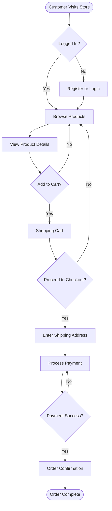
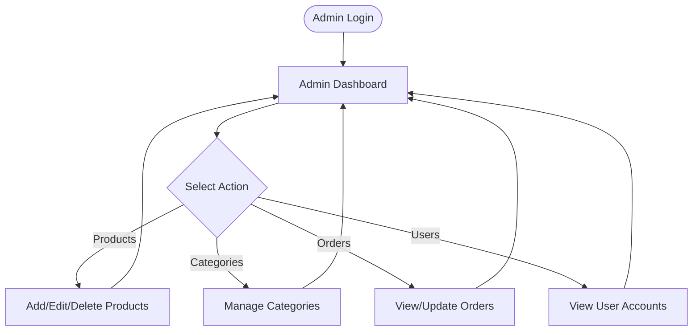
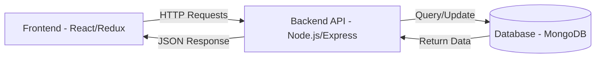

# Ecommerce Application Flow Diagrams

## User Purchase Flow

```mermaid
flowchart TD
    Start([Customer Visits Store]) --> Login{Logged In?}
    Login -->|No| Register[Register or Login]
    Login -->|Yes| Browse[Browse Products]
    Register --> Browse
    Browse --> ViewProduct[View Product Details]
    ViewProduct --> AddCart{Add to Cart?}
    AddCart -->|Yes| Cart[Shopping Cart]
    AddCart -->|No| Browse
    Cart --> Checkout{Proceed to Checkout?}
    Checkout -->|No| Browse
    Checkout -->|Yes| Shipping[Enter Shipping Address]
    Shipping --> Payment[Process Payment]
    Payment --> Success{Payment Success?}
    Success -->|No| Payment
    Success -->|Yes| OrderConfirm[Order Confirmation]
    OrderConfirm --> End([Order Complete])
```

## Admin Management Flow

```mermaid
flowchart TD
    Admin([Admin Login]) --> Dashboard[Admin Dashboard]
    Dashboard --> Manage{Select Action}
    Manage -->|Products| AddProd[Add/Edit/Delete Products]
    Manage -->|Categories| AddCat[Manage Categories]
    Manage -->|Orders| ManageOrder[View/Update Orders]
    Manage -->|Users| ManageUser[View User Accounts]
    AddProd --> Dashboard
    AddCat --> Dashboard
    ManageOrder --> Dashboard
    ManageUser --> Dashboard
```

## Application Architecture

```mermaid
flowchart LR
    Client[Frontend - React/Redux]
    API[Backend API - Node.js/Express]
    DB[(Database - MongoDB)]
    Client -->|HTTP Requests| API
    API -->|Query/Update| DB
    DB -->|Return Data| API
    API -->|JSON Response| Client
```
